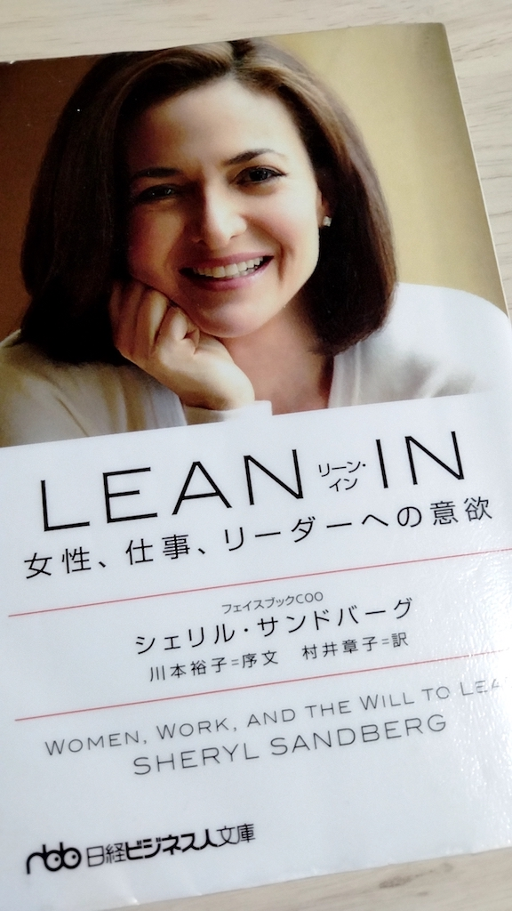

# LEAN IN 女性、仕事、リーダーへの意欲(シェリル・サンドバーグ)を読んで[書評]

[[toc]]

## どんな本か

アメリカの政府や企業のリーダーの大多数は男性（出版当時の話だと思うが、2022年時点でも大きく変わらないのかもしれない）であり、社会生活に多きな影響を与える決定にて、女性の声が反映されにくい状況が続いている。女性が社会でより活躍しやすい環境をつくるにはどうしたらよいのかが、著者の実体験をもとに示された本。  
本書はこちら：[LEAN IN 女性、仕事、リーダーへの意欲](https://www.amazon.co.jp/dp/4532318971)  
※英書は[こちら](https://www.amazon.com/dp/0385349947)

## どんな人に読んでほしいか

- 仕事やキャリアを含め、人生で悩んでいる女性
- 男女平等な社会を築きたいと考えている男性
- チームメンバーに女性がメンバーにいるリーダーが読むことで、より優れたリーダーになれると感じた

## 印象に残った点はどこか

女性が社会で活躍するための心構えやヒューマンスキルなど技術的なアドバイスやキャリアの考え方が紹介されているが、一番印象に残ったのは、仕事・家事・育児というそれぞれ大変な作業をどのように捉えているのかという点がとても印象的だった。  
次に、個人的に印象に残った点をいくつか記す。

### キャリアは梯子ではなくジャングルジム

著書では、
> 2010年の時点で、平均的なアメリカ人は18〜46歳の期間だけで11の仕事を経験している。つまり、一つの企業なり組織なりに就職し、そこで一本の梯子を上っていく時代はとうの昔に過ぎ去ったのである。

とある。  
著書時点から10年以上経っているため、現状がどういう状況なのかは分からないがおそらく更にジャングルジムのキャリアとしている人が増えているのではないかと予想している。日本でも、業界によって差はあるかもしれないが、一昔前と比べるとジャングルジムのキャリアはやりやすくなったのではないかと考えているし、その方が変化に強いキャリアを積めるとも考えている（もちろん、肌感覚ではまだまだ改善点があると思うが)。  
男性はもちろんだが、特に子供が欲しい女性の場合、産休育休をとる必要性があり一度梯子から降りたとしても、別のキャリアを進めるような社会になっていると選択肢が広がり、結果その人の人生が豊かになると感じた。  

### リーダーは完璧をめざすよりも自分らしくあるべき

本書の第６章では、本音のコミュニケーションをするためのTopicがいくつか紹介されている。個人的に刺さったポイントが以下である。

- よいリーダーシップとは「気づき」のリーダーシップである
- 自分の弱点をオープンに話すのも一つの方法
- 感情を分かち合うことで、人間同時の関係が深くなる

章末でも語られている通り、これらは感受性豊かなタイプの女性が得意とする部分なのかと感じた。  
一個人としても、仕事をする上で心がけたいと思う。

### 子供を育てるのは父親か母親か

アメリカでも日本のように、子育ての大半を女性が引き受けているのには少し意外だった（無論、2022年時点では変わっているかもしれない）。要因としては、夫の勤務時間が長い、「子育ては妻がするもの」という世間のステレオタイプなどいくつかあるようだが、日本でも同じような状況であると感じている。  
`子供が生まれたことを会社の同僚や上司に報告したら、父親は「おめでとう！」と言われるが、母親は「おめでとう、で、仕事はどうするの？」`というのはステレオタイプのあるあるだと感じた。私自身も両方の立場として経験をしたことがある。これからは気をつけるようにしたいと思う。  
また、この話を読んで、日本では2022年4月から「育休の周知・意向確認義務」が育児・介護休業法の改正によって始まる。育休を取得しやすい「社内の雰囲気づくり」というのが狙いとされているものなので、この法改正もきっかけの一つとして、社会全体のステレオタイプが良い方向に変わっていくと良いなと思う。  
私個人としても、家事・育児を妻と協業で進め、「妻が仕事を辞めなければならない」という状況とならないように努めていきたいと考え、今もなお行動している。

## まとめ

女性が仕事を辞め、家庭に入るのが通常である、という考え方は古く、今の時代は多様化してきていることを改めて感じた。女性が家庭だけではなく、様々なシーンで活躍するための選択肢を増やすには、現状のステレオタイプを取り除き、男性側も協業していくことが大切であると感じた。  
妻はもちろん、仕事上のチームメンバーで女性と一緒に仕事をする際は、本書で語られている内容を意識して活動することで、メンバーがオンでもオフでもハッピーに過ごせる環境が目指せると思う。  
気になった方はぜひ読んでみてください。
