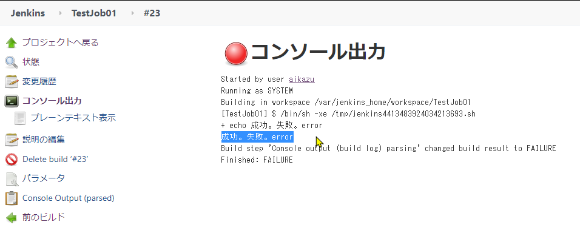
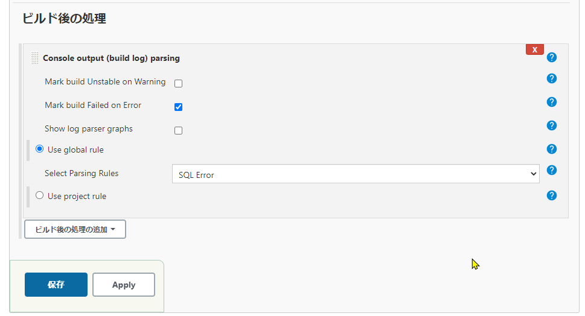

# Jenkins Tips[Jenkins]

JenkinsのTipsをメモ。

## ジョブ内でビルドパラメーターを利用する

下図のような、ジョブ実行時にテキストベースで指定したパラメーターを使用する方法。


ジョブの設定画面で、「ビルドのパラメータ化」の名前を設定する。


ビルド設定にて、`$ビルドパラメータの名前`で設定すると利用することができる。

※シェルの実行の場合だけかも。他のビルド手順は未確認。

```bash
echo $logcontent
```


ジョブを実行すると、指定したパラメータが利用できていることが分かる。



## コンソールログを元にジョブの成功/失敗を判定する[Log Parser]

[Log Parser](https://plugins.jenkins.io/log-parser/#documentation)というプラグインを使うと、指定した条件で、ジョブの実行によって出力されるコンソールログを解析してくれる。解析した結果、ジョブを成功扱いにしたり、逆に失敗扱いにすることができる。

例えば、失敗になって欲しいジョブが何かしらの理由で成功となってしまう（サードパーティ製の処理をしており、処理結果を変えることができない…とか）場合に、出力されるコンソールログを元に、失敗にたおすことができる。

### 使い方

`Log Parser`プラグインをインストールし、Jenkinsを再起動する。

`Jenkinsの管理` -> `システムの設定` -> `Console Output Parsing` で「追加」ボタンを押し、`Description`にルールの概要、`Parsing Rules File`にルールが記載されたファイルのパスを記載する。


※**補足：** パスの指定がちょっとハマりどころ。どうも、相対パスだと読み取ってくれないようで、**絶対パスで指定する**必要がありそう。（相対パスでもできるやり方をご存知の方教えていただけると…）絶対パスで指定する場合は、Jenkinsのホームディレクトリ（例だと`/var/jenkins_home`）で指定する。ルールが記載された実ファイル自体は、Jenkinsのホームディレクトリで指定されている実際のディレクトリに配置する必要がある。今回の例だと、Jenkinsホームディレクトリの実態は`/home/(UserName)/jenkins`としているので、この配下にルールファイルを配置していく。ファイルの配置と設定が噛み合わない状態だと、ジョブ実行時に以下のようなExceptionが発生する。


上記の例で指定しているファイル`sqlerror.txt`には、

```txt
error /error/
```

としておく。これは、**errorという文字が含まれていたらジョブを失敗扱いとする**ルールとなる。

設定が終わったら、「保存」もしくは「Apply」ボタンを押す。これでルールの定義自体は終わり。

次に、ルールを設定したいジョブの設定画面を開く。`ビルド後の処理の追加`で、`Console output (build log) parsing`を選択する。すると、入力エリアが表示されるので設定を行う。

 - `Mark build Failed on Error`をチェックON
 - `Use global rule`を選択し、`Select Parsing Rules`で先ほど定義したルール`SQL Error`を選択



以上で設定が完了。

ジョブを実行し、コンソールログに`error`が含まれていると、ジョブが失敗扱いとなることが分かる。便利～。


## 権限（執筆中）


### 参考サイト

[Jenkins がもっと便利になるおすすめプラグイン 8 つ](https://blog.fenrir-inc.com/jp/2012/12/jenkins_plugins.html)
