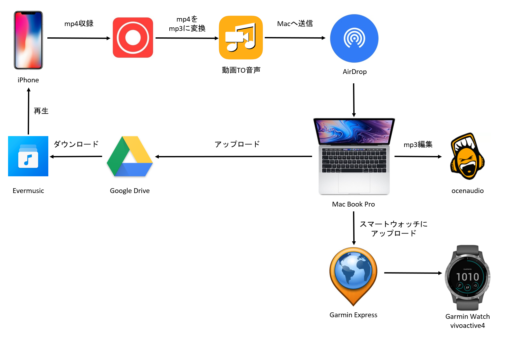

# iPhoneで録画/録音したBGMをiPhoneやスマートウォッチで再生したい！

iPhoneでプレイしているゲームで使われているBGMがお気に入りで、ランニング中に聞きながら走りたいなと考えていました。
その方法を少し検証してみたところ、多少面倒さは残っていますが運用にのせられましたので、その内容をメモします。

## 全体イメージ

iPhoneでプレイしているゲームを動画として録画し、その動画からBGMのみを抜き出したファイルをiPhoneに戻すイメージです。
また、最近スマートウォッチも入手し、ランニング時にはiPhoneは所持せずスマートウォッチだけ装備して走るため、スマートウォッチにも同じBGMファイルを登録しています。

1. iPhoneの「画面収録」でゲーム動画を記録する
2. iPhoneの「動画TO音声」で動画からBGMを抽出する
3. iPhoneの「AirDrop」で抽出したBGMをMacへ送る
4. Macの「ocenaudio」でBGMを編集する
5. Macから「Google Drive」にBGMをアップロードする
6. iPhoneの「Evermusic」でBGMをダウンロード・再生する
7. Macの「Garmin Express」でBGMをスマートウォッチにアップロードする

## 使用する端末

- iPhone 7
- Mac Book Pro 2016 OS:Mojave
- Garmin vivoactive4

## 使用するツール

- iPhone画面収録
- 動画TO音声
- AirDrop
- ocenaudio
- Google Drive
- Evermusic
- Garmin Express

## 手順

### 1. iPhoneの「画面収録」でゲーム動画を記録する

「画面収録」iOS 11で追加された機能で、iPhoneでプレイしているゲームをキャプチャ動画としてiPhone内に記録することができます。

https://support.apple.com/ja-jp/HT207935

まずはこの機能を使って、好きなBGMが流れるシーンをキャプチャします。キャプチャした動画ファイルはmp4形式で保存され、iPhoneの「写真」アプリから確認ができます。

### 2. iPhoneの「動画TO音声」で動画からBGMを抽出する

キャプチャした動画を、iPhoneの「動画TO音声」というアプリを使ってBGMのみを抽出します。

https://apps.apple.com/jp/app/%E9%9F%B3%E5%A3%B0%E6%8A%BD%E5%87%BA-%E5%8B%95%E7%94%BBto%E3%82%AA%E3%83%BC%E3%83%87%E3%82%A3%E3%82%AA-%E5%8B%95%E7%94%BB%E3%81%8B%E3%82%89%E9%9F%B3%E5%A3%B0%E6%8A%BD%E5%87%BA/id1260980663

アプリ自体の使い方はシンプルです。

アプリを起動し、抽出したい動画を選択します。動画を選択すると「音声抽出」が表示されるので、「ビデオアイコン→音楽アイコン」のようなアイコンをタップします。すると、抽出の設定ができるので、フォーマットをmp3に設定して「抽出」ボタンをタップします（他の設定は適当な内容を設定します）。

暫くすると、抽出が完了します。フッター部分にある「オーディオ」タブをタップすると、抽出したmp3ファイルを確認できます。

### 3. iPhoneの「AirDrop」で抽出したBGMをMacへ送る

iPhone標準搭載の「AirDrop」を使って、抽出したBGMをMacへ送ります。
先述のアプリ「動画TO音声」の「オーディオ」タブ内で、Macへ送りたいmp3ファイルをタップし、「他のアプリで開く/シェア」をタップします。送り先の一覧に「AirDrop」が表示されるのでタップし、送り先のMacを選択してmp3ファイルを送ります。

### 4. Macの「ocenaudio」でBGMを編集する

オーディオエディタであるocenaudioを使って、mp3を編集します。

https://www.ocenaudio.com/

私の場合は最低限の編集として…

- 音の長さを適切な長さまでカット
- 最初の無音時間を少し作る
- 最後は徐々に音を小さくして終了するようにする
- ファイルのタイトルを設定する
- ファイルのサムネイルを設定する

辺りをいじっています。編集が終わったら、ファイルを保存し、いよいよアップロードを行います。

### 5. Macから「Google Drive」にBGMをアップロードする

まずはiPhone向けとして、Google DriveにBGMをアップロードします。
Google Driveへのアップロードの仕方はそんなに難しくないのでここでは割愛します。

### 6. iPhoneの「Evermusic」でBGMをダウンロード・再生する

iPhoneアプリ「Evermusic」は音楽再生用プレイヤーの一つです。
Google DriveやDropboxなどのクラウドに接続し、ダウンロードすることができるので便利です。

https://apps.apple.com/jp/app/evermusic-%E3%83%80%E3%82%A6%E3%83%B3%E3%83%AD%E3%83%BC%E3%83%89-%E9%9F%B3%E6%A5%BD-%E9%9F%B3-%E3%82%A4%E3%82%B3%E3%83%A9%E3%82%A4%E3%82%B6/id885367198

このアプリを利用して、Google DriveにアップロードしたBGMをiPhoneにダウンロードしたり、ストリーミング再生で楽しんでいます。

### 7. Macの「Garmin Express」でBGMをスマートウォッチにアップロードする

さらに、私が所持しているスマートウォッチ Garmin vivoactive4もBGMを再生する機能を持っているので、スマートウォッチにもアップロードをしてみます。

Garmin製のデバイスをPCから管理できる、「Garmin Express」というMac用のアプリケーションを使ってアップロードをします。

https://www.garmin.com/ja-JP/software/express

**※Garmin Expressは、アップロード元としてiTunesしか選択できないようです。なので、アップロードしたいBGMは予めiTunesに登録する必要があります。**

MacとGarmin vivoactive4をUSBで接続し、Garmin Expressを起動します。「音楽」をクリックし、左のメニュー「iTunesライブラリ」からアップロードしたいファイルにチェックを入れ、「デバイスへの送信」ボタンをクリックします。

以上で、Garmin vivoactive4へのアップロードが完了します。Garmin vivoactive4にて、アップロードされたBGMを確認します。

## まとめと課題

iPhoneで録画/録音したBGMをiPhoneやスマートウォッチで再生するための手順を紹介しました。
これで、移動中やランニング中など様々なシーンで好きなBGMを聞ける環境ができました！

しかし、手順が多く作業が面倒なのが課題だと感じています。もっとスマートな方法がないかなどアップデート情報があれば都度更新していこうかと思います。
