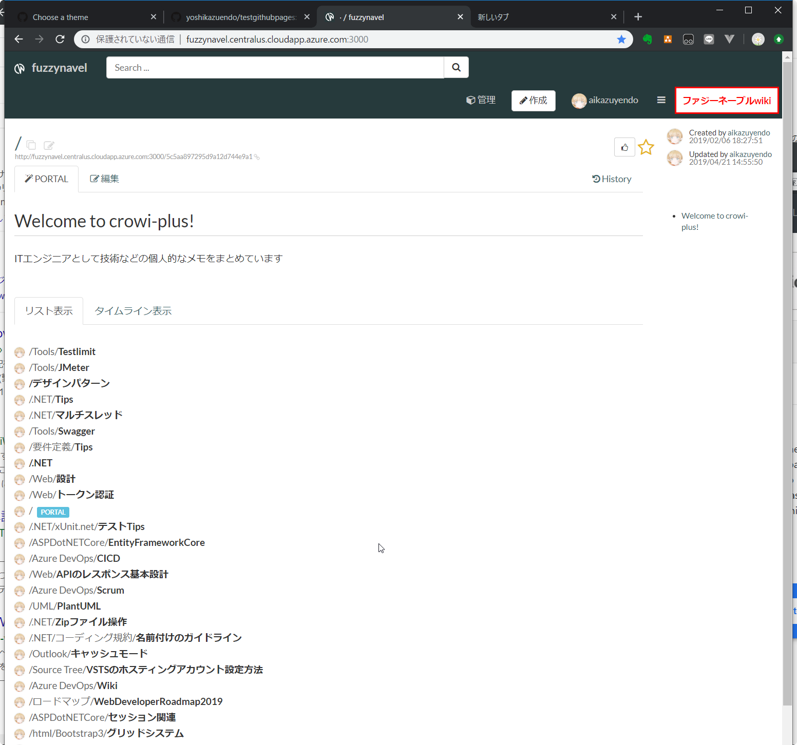

# 2020年に向けて自分用ドキュメントツールを見直してみた[Visual Studio Code][VuePress][GitHub Pages][CircleCI]

特に理由は無いですが2020年も近いことですし自分用ドキュメントツールを見直してみようかと思います。

本稿では、ドキュメントツールを見直した際に行った作業を記録しておきます。

[[toc]]

## 前置き

自分用のメモとして、技術的なことを調査した内容や検証してみた結果を、ドキュメントツールで記録をしていました。「前にアレやったことあったけどどうだったかな～」といった際に見直すことができたり、記録をする行為を経て「ああ、自分この辺わかってないなー」と気付けるきっかけにもなったりとメリットを感じていました。

### これまで使っていたドキュメントツール

2009年～2016年まで：pukiwiki

　PHPで動作するウィキクローンの一つ。自宅のノートPCをサーバーにして立ち上げてました。引越しを機に廃止。

2016年～2019年（現在）：Crowi-Plus

　Markdownで書けるWiki。pukiwikiとは違ったWikiサービス＆Markdownに慣れたかったので採用(pukiwikiでも頑張ればMarkdownで書けそうだけど）。自宅オンプレだと電源を入れっぱなしにする必要があるなど色々と面倒だったので、AzureにVMを立てて管理していました。現在もこれで運用中。



## どんなドキュメントツールを使いたいか

- Markdownで書きたい
  - リアルタイムでプレビューしたい
  - 画像を貼りたい
- クラウドにのせる
- クラウドサービスを使うのにお金をかけたくない
  - Azureは無償の範囲内で使えて入るが、その恩恵が受けられなくなる可能性もあるので事前に対策しておきたい気持ちもあった。
  - GCPの無料枠も悪くはないと思ったが今回はパス
- GitHub Pagesに公開したい
  - ドキュメントは最終的にはGitHub Pagesに公開したい（GitHubのCommit色をつけたい欲求も満たされる）
- ツールは今っぽいサービスを使いたい
  - GitBook v1（オンプレ向け）はメンテされていないなのでNG
  - GitBook v2 はホスティングのみなのでNG
  - docsifyも魅力的ではあるが、メンテされていない可能性あり？
  - MkDocs python基盤のMarkdownで書けるドキュメントツール。これも候補だった
  - VuePress
    - 去年あたりから流行っていそう？面白そうなので使ってみたい

ってことでVuePressを使ってみることにしました。

## [VuePress](https://vuepress.vuejs.org/)とは

VuePressは、Vue.jsの作者Evan You氏が作成した静的サイトジェネレータです。Markdownで書かれたファイルを元にHTMLを生成することができるのが特徴です。他にも、Markdown内でVueが使用できたり、Vueを利用してカスタムテーマの開発が可能だったりするそうです。

## 環境を準備する

ということで、VuePressを使ったドキュメント管理をするための環境を作ります。

利用OSやソフトウェアは以下を使用しています。

- OS: Windows 10
- Visual Studio Code: v1.40.2
- Node.js： v10.16.3
- npm： v6.9.0
- VuePress： 1.2.0

## 1. Visual Studio Code をインストールする

ドキュメントのエディタとして、Visual Studio Codeを使用します。
[公式サイト](https://azure.microsoft.com/ja-jp/products/visual-studio-code/)よりダウンロードしインストールします。

Visual Studio Codeのインストールが完了したら、Markdownを便利に編集するために、以下のExtensionをインストールします。

- Markdown All in One
  - Markdownファイルを開いた状態で`Ctrl + KV`するとプレビューが表示される。
- markdownlint
- Paste Image
  - クリップボードに画像をコピーした状態でVSCode上で`Ctrl + Act + V`するとMarkdown上に画像をペーストできる。
- Excel to Markdown table
  - Excel上のセルをコピーした状態でVSCode上で`Shift + Alt + V`するとMarkdownの表形式でペーストできる。
- ※Markdownとは直接関係ないが、以下のExtensionもついでにインストールしておく
  - Japanese Language Pack for Visual Studio Code
  - vscode-icons

### 1.2. Paste Imageの設定

クリップボードにコピーしている画像をMarkdownへ貼り付けしてくれる便利なExtensionですが、既定の設定のままだと画像の保存先がいまいちなので少し設定を変えます。

#### Default Name

既定のファイル名を定義できます。今回はハイフンを除いただけ。


#### Path

画像の保存先を定義できます。今回は`src\public\images`ディレクトリに格納したいので変更しました。さらにMarkdownのファイル名のフォルダを切った上で格納するようにしています。


#### Prefix

Markdown上の画像のリンクパスのプレフィックスを定義できます。前述の`Path`の設定でリンクのパスが下記の通り生成されるようになります。

``

しかし、VuePressの開発環境上で表示しようとするとリンク不正となりブラウザ上で表示エラーとなってしまいます。


## 2. Node.js をインストールする

VuePressを使うにはNode.jsが必要なためインストールします。
[公式サイト](https://nodejs.org/en/download/)よりダウンロードしてインストールします。

インストールが終わったらコマンドを叩いて確認します。（npmも一緒に入るはず）

```bash
$ node --version
v10.16.3

$ npm --version
6.9.0
```

## 3. VuePress をインストールする

npmを使ってインストールします。

```bash
$ mkdir mywiki
$ cd mywiki
$ npm init -y
$ npm i -D vuepress
```

しばらくするとインストールが完了します。コマンドを叩いてインストールされたことを確認しまします。

```bash
$ npm list vuepress
`-- vuepress@1.2.0
```

## 4. VuePress の設定

Markdownを書き始める前に、VuePressの設定周りをいじっておきます。

### 4.1. ディレクトリを構成する

VuePressのディレクトリを構成します。詳しくは公式サイトの[ディレクトリ構造](https://vuepress.vuejs.org/guide/directory-structure.html)を参照ください。

今回は以下の通り構成しています。

```txt
.
├ docs
│ ├ assets
│ ├ images
│ ├ [Markdownを元に生成されたhtmlファイル、ディレクトリ]
│ ├ 404.html
│ └ index.html
├ src
│ ├ .vuepress
│ │ ├ public
│ │ │ └ images
│ │ │   └ [画像を格納するディレクトリ、ファイル]
│ │ └ config.js
│ ├ [Markdownを格納するディレクトリ、ファイル]
│ └ README.md
└ package.json
```

#### docsディレクトリ配下

docsディレクトリ配下は、VuePressのビルド時に自動的に生成されます。なので事前準備としてはdocsディレクトリを作成しておくだけでOKです。

また、docsディレクトリはGitHub Pagesの公開ディレクトリとして設定しますが、詳しくは後ほど。

#### srcディレクトリ

Markdownや挿入したい画像などを格納するディレクトリです。今回はVuePressのビルド対象としているルートディレクトリとなります。docsディレクトリとは違い、srcディレクトリ配下のファイル群は全て自分で作成していきます。

Markdownはsrcディレクトリ配下に格納しますが、格納する相対パスとページルーティングパスが深く関連しているので、Markdownの配置先は意識する必要があります。
| 相対パス               | ページルーティングパス     |
|--------------------|-----------------|
| src/README.md      | /               |
| src/wiki/README.md | /wiki/          |
| src/wiki/test.md   | /wiki/test.html |

#### src\.vuepressディレクトリ

`config.js`（VuePressの構成ファイル）や、画像などの静的ファイルを配置する`publicディレクトリ`を格納します。

publicディレクトリ配下は、VuePressをビルドするとdocsディレクトリ配下にコピーされます。

#### package.jsonファイル

VuePressインストール時の過程で一緒に作成されます。

### 4.2. package.json にVuePress用コマンドを追記する

package.json に以下の通りVuePress用コマンドを追記します。

```json
～中略～
"scripts": {
  "dev": "vuepress dev src",
  "build": "vuepress build src"
},
～中略～
```

`dev`、`build`はsrcフォルダに対してそれぞれ、VuePressの開発環境を起動、ビルド（静的ファイルの生成）するコマンドとして使用します。

### 4.3. VuePressの構成ファイルを編集する

VuePressは、サイト構成に対して色々なカスタマイズが可能なようです。詳しくは公式サイトの[設定](https://vuepress.vuejs.org/guide/basic-config.html#config-file)や[構成リファレンス](https://vuepress.vuejs.org/config/)を参照ください。

今回はいくつかの設定値を編集し、以下のような設定としています。

```js
const fs = require('fs');
const rootpath = "./src"; // 操作対象のルートディレクトリパス

// ルートディレクトリ直下のディレクトリ名を取得する。
var childDirctories = fs.readdirSync(rootpath).filter((f) => {
  // .vuepressディレクトリは除く。
  return fs.existsSync(rootpath + "/" + f) && fs.statSync(rootpath + "/" + f).isDirectory() && f != ".vuepress";
})
// console.log(childDirctories);

// 各ディレクトリ配下のファイル名を元にsidebarのgroup要素とchildren要素を生成する。
// ※加えて、トップページ用の''も生成しておく。
var sidebarElement = [''].concat(childDirctories.map((dir) => {
  return {
    title: dir,
    collapsable: false,
    children: fs.readdirSync(rootpath + "/" + dir).map((filename) => {
      return childPath = dir + "/" + filename
    })
  };
}));
// console.log(sidebarElement);

module.exports = {
  title: 'aikazuyendo\'s memo',
  description: '個人的に気になったことを調査したりやってみた結果をメモしています',
  dest: 'docs/',
  base: '/mywiki/',
  markdown: {
    lineNumbers: true, // コードブロックに行番号を表示
    linkify: true, // URL記述を自動的にリンクさせる
    toc: {
      includeLevel: [2, 3, 4, 5, 6] // [[toc]]の対象とする見出しレベル
    }
  },
  head: [
    ['link', { rel: 'icon', type: 'images/png', href: '/images/favicon.png' }],
  ],
  themeConfig: {
    nav: [
      { text: 'Home', link: '/' },
      { text: 'About', link: '/about/' },
      { text: 'GitHub', link: 'https://github.com/yoshikazuendo/mywiki' }
    ],
    sidebar: sidebarElement
  }
}
```

#### 4.3.1. title Config

サイトのタイトルを定義できます。すべてのページタイトルとして反映されるようです。VuePressのデフォルトテーマの場合、ナビゲーションバーに表示されます。


#### 4.3.2. dest Config

srcフォルダ内のMarkdownに対してVuePressをビルドするため、ビルドで生成される静的ファイルをdocsフォルダに格納するように構成ファイルを編集します。
最終的には静的ファイルを含めGitHubにpushし、docsフォルダをGitHub Pagesの公開ディレクトリパスとするためこの設定を設けています。

#### 4.3.3. base Config

GitHub Pagesなどへデプロイする際に設定する必要があるようです。
例えば、GitHub PagesのURLが`https://yoshikazuendo.github.io/mywiki/`の場合は、base Configに`/mywiki/`を設定する必要があります。

#### 4.3.4. head Config

headタグへ情報を組み込みたい場合は`head Config`に記載をしていくそうです。ここでは、faviconを設定しています。`head Config`要素はList形式なので、他にも色々設定できるようです。

#### 4.3.5. themeConfig -nav-

サイトのヘッダー部分にナビゲーションのリンクを設定することができます。こちらもList形式なので複数設定が可能です。

#### 4.3.6. themeConfig -sidebar-

サイトの左側にサイドバーを表示することが可能です。ここでは、サイトマップ的に本サイトの全ページをリンクで並べたいですが、ページの増減がある度にこの要素も編集するのは少し面倒です。なので、`src`ディレクトリ配下のmarkdownファイルを対象に`sidebar`要素を生成するJavaScriptで補うこととしました。

ディレクトリを`sidebar`要素の`Group`とし、リンクのグルーピングも表現しています。

### 4.4. VuePressの開発環境を起動する

以下のコマンドを実行すると開発環境が立ち上がります。

```bash
$ npm run dev
```


表示されたURLにアクセスするとブラウザで動作確認ができます。


なお、開発環境を立ち上げた状態でMarkdownを修正すると、その内容がリアルタイムでブラウザに反映されます。

### 4.5. VuePressのビルドをする

以下のコマンドを実行するとビルドが行われ、htmlなどの静的ファイルが生成されます。

```bash
$ npm run build
```

今回は、docsフォルダ配下に静的ファイルが生成されます。


### 4.6. GitHub Pagesへ公開する

### 4.7. GitHub Pagesにアップロード

### 4.8. デプロイを自動化する

## 5. [2020/05/03追記] GitHub のSecurity Alertsを対応してみた

GitHubからSecurity Alertsのメール通知が飛んできていました。Security Alertsは、GitHub側にてリポジトリに悪影響を及ぼす脆弱性を検出してくれて、ユーザーに通知してくれる仕組みのようです。（詳しくは[公式ページ](https://help.github.com/ja/github/managing-security-vulnerabilities/about-security-alerts-for-vulnerable-dependencies)へ）

GitHubでかなり放置していましたが、時間ができたので対応してみようかと思います。


例えば以下のアラート。serialize-javascriptのバージョンが古くてアラートがあがっているようです。


`package-lock.json`の`serialize-javascript`のバージョンが古いものが指定されているのが原因のようです。
mywikiで使っているVuePressのバージョンが古いのがそもそもの原因だと思うので、
```bash
$ npm update
```
でアップデートをし[push](https://github.com/yoshikazuendo/mywiki/commit/d6a699692522a18d9508cc2219a081f03dcdd835)します。

pushすると、Security Alertsが解消されるようです。Security Alertsのページにアクセスし、以下の通り綺麗に警告が消えていることが確認できました。

どうやら、他のSecurity Alertsも`npm update`で解決したようです。

## 参考サイト

- [VS code で最強の Markdown 環境をつくる方法 -『tool』](https://webmanab-html.com/tip/vs-code-markdown/)
- [Paste Image](https://marketplace.visualstudio.com/items?itemName=mushan.vscode-paste-image)
- [【VSCode】Visual Studio Code のユーザー設定をカスタマイズ](https://mattyan1053.hatenablog.com/entry/2018/08/02/021144)
- [VuePressで自分向けのWiki的なページを作成した](https://yoshinorin.net/2019/10/06/create-wiki-by-vuepress/)
- [VuePress入門](https://www.nxworld.net/services-resource/hello-vuepress.html)
- [VuePress+GitHub Pagesで独自ドメイン＋HTTPS対応のサイトを作る in 2018](https://qiita.com/crea/items/9751c50d4c15a6b60ae1)
- [VuePress で静的ページを作成し、GitHub Pages に公開する](https://y4shiro.github.io/vue-press/)
- [【CircleCI】CircleCI 2.0からはじめる個人での簡単なCI導入方法 - githubとの連携まで](https://tweeeety.hateblo.jp/entry/2018/02/09/195345)
- [VuePressの基礎基礎メモ](https://nogson2.hatenablog.com/entry/2019/07/04/191648)
- [VuePress Config Reference](https://vuepress.vuejs.org/config/#basic-config)

[fuzzynavel](http://fuzzynavel.centralus.cloudapp.azure.com:3000/)
